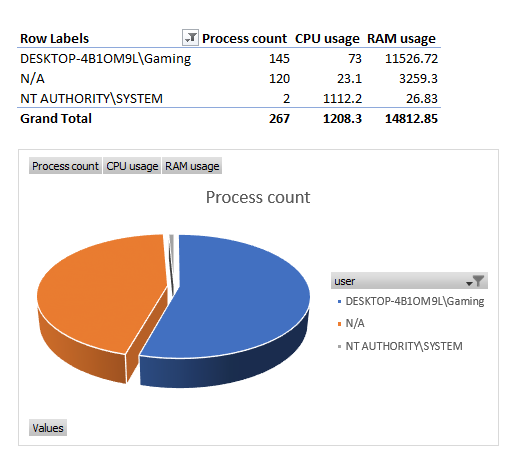
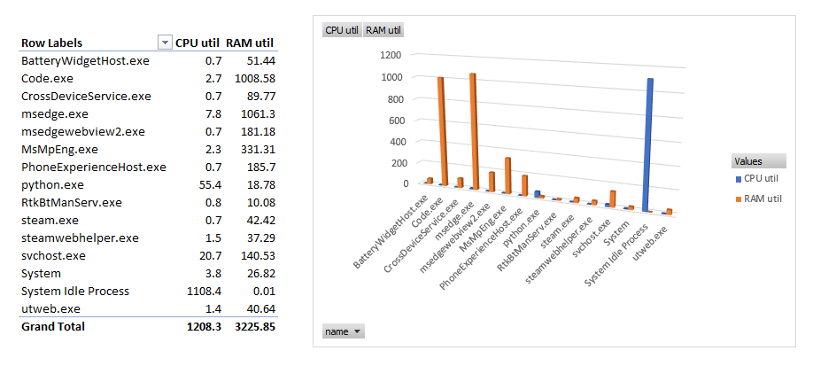

# 🧾 Process Reporter Tool

_This repository was created as part of a practical interview task._

To demonstrate different levels of usability and portability, the project includes **two versions** of a tool that generates detailed reports of running processes on a machine:

---

## 🟦 `Single-platform/` – Zero Dependencies

Platform-specific tools written using native scripting languages. Detailed instructions and alternatives in [`Single-platform/README.md`](./Single-platform/README.md)

### 🔹 Windows
- `.bat` launcher that calls a PowerShell script to generate a process report in **CSV format**
- No dependencies required — runs on any modern Windows system
- Has limitaion of listing process user in the report

### 🍏 macOS
- `.sh` shell script using native **AppleScript dialogs** to export reports in **CSV or JSON**
- Fully self-contained; no external dependencies
- Also available as a ready-to-use native app in [GitHub Releases](https://github.com/Arsenoid2/process-report/releases/tag/v1.0.0)  
  ⬇️ [Download Process Reporter for macOS](https://github.com/Arsenoid2/process-report/releases/download/v1.0.0/Process.Reporter.zip)

---

## 🐍 `Cross-platform/` – Python CLI Version

A flexible CLI tool built with Python that runs on **both Windows and macOS**.

### ✅ Features
- Reports: `pid`, `name`, `user`, `cpu_percent`, `memory_mb`
- Output formats: **CSV** or **JSON**
- Interactive prompts or CLI arguments
- One-click launchers:
  - `launcher.bat` for Windows
  - `launcher.command` for macOS
- Includes:
  - 🔁 CI pipeline via GitHub Actions
  - 🧪 Automated tests using `pytest`

Details in [`Cross-platform/README.md`](./Cross-platform/README.md)

---

## 📦 Infrastructure as Code

- The `IaC_ansible/` directory contains an [Ansible playbook](./IaC_ansible/playbook.yml) for automated setup and deployment of the Python version.
- Designed for Windows targets using remote PowerShell execution.

---

## 📖 How to Get Started

Choose one of the following:

- **No Python?** Use the scripts in [`Single-platform`](./Single-platform/) for quick results.
- **Python available?** Try the full-featured version in [`Cross-platform`](./Cross-platform/).

Each subfolder has its own `README.md` with platform-specific instructions.

---

## 📊 Visualization

Once a process report is generated (either as `.csv` or `.json`), you can analyze it using any spreadsheet or visualization tool — such as **Excel**, **Google Sheets**, or **LibreOffice Calc**.

These tools allow you to quickly explore and visualize system metrics such as:

- Total number of running processes per user
- Aggregate CPU or memory usage per user
- Most CPU- or memory-hungry processes
- And combine some filters together

---

### 🔎 Example Visualizations

Below are a few example insights generated using Microsoft Excel's **Pivot Tables** and **Charts** created in the [process_report.csv](./visualizations/process_report.csv) file.

#### 🧍 Process Count per User (Pie Chart)

This shows the number of processes attributed to each user on the system:

#### 🧠 Resource Usage by Process (Column Chart)

This report identifies processes consuming the most **CPU time** and **RAM**:

---

### 🛠️ How to Create

You can generate similar visualizations by:
1. Inserting a **Pivot Table** from your `process_report.csv`
2. Dragging fields like `user`, `name`, `cpu_percent`, and `memory_mb` into Rows/Values
3. Switching aggregation mode (e.g., from Sum to Count) if needed
4. Adding **Charts** (Pie, Bar, or Column) from Excel’s ribbon

In MacOS, the generated CSV file may appear in a single-line format when opened in Excel. To properly display the data in separate columns:
> Go to Data → Text to Columns, then choose Comma as the delimiter to split the values into individual columns.

More advanced dashboards can be created with Power BI, Tableau, or open-source tools like Apache Superset.

---

Happy reporting and thanks for considering my candidacy! 📊